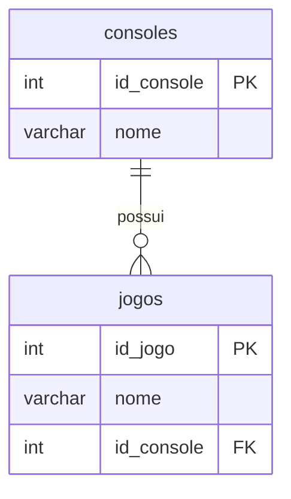

# constraints

As **constraints** (restrições) são regras aplicadas a colunas ou tabelas para garantir a **integridade, precisão e consistência** dos dados. No MySQL, elas são fundamentais para manter a qualidade do banco de dados.

### O que são Constraints?

São limitações que definem como os dados podem ser inseridos, atualizados ou excluídos:
- **Propósito**: Evitar dados inválidos, duplicatas ou relações quebradas.
- **Localização**: Aplicadas no nível de coluna ou tabela.
- **Tempo**: Validadas durante operações de `INSERT`, `UPDATE` e `DELETE`.

### Tipos de Constraints

- `PRIMARY KEY` : identifica unicamente cada registro em uma tabela;
- `FOREIGN KEY` : mantém a **integridade referencial** entre tabelas relacionadas;
- `UNIQUE` : garante que todos os valores em uma coluna sejam distintos;
- `NOT NULL` : impede que valores `NULL` sejam inseridos em uma coluna;
- `CHECK` : valida dados com base em uma expressão lógica;
- `DEFAULT` : define um valor automático quando nenhum é especificado;

## `Primary Key`

A **Primary Key** (chave primária) é um conceito fundamental em bancos de dados relacionais. No MySQL, ela garante a **integridade e unicidade** dos dados em uma tabela.

### O que é uma Primary Key?

É uma **coluna (ou conjunto de colunas)** que identifica **exclusivamente** cada registro em uma tabela.
- **Valores únicos**: Não podem existir dois registros com a mesma chave primária.
- **Não nulos (`NOT NULL`)**: A coluna não pode ter valores `NULL`.
- **Única por tabela**: Cada tabela pode ter **apenas uma** primary key.
- **Índice automático**: O MySQL cria automaticamente um índice `PRIMARY` (clustered) para otimizar buscas.

### Por que usar uma Primary Key?

- **Evitar duplicatas**: Garante que cada registro seja único.
- **Relacionamentos**: Permite criar chaves estrangeiras (`FOREIGN KEY`) para vincular tabelas.
- **Desempenho**: Acelera operações de busca (`SELECT`), atualização (`UPDATE`) e exclusão (`DELETE`).
- **Integridade referencial**: Base para relações entre tabelas.

### Sintaxe

- **Durante a criação da tabela (coluna única):**
    ```sql
    CREATE TABLE clientes (
        id INT PRIMARY KEY,           -- Coluna única como PK
        nome VARCHAR(50) NOT NULL,
        email VARCHAR(100)
    );
    ```

- **Durante a criação (múltiplas colunas):**
    ```sql
    CREATE TABLE pedidos (
        cliente_id INT,
        pedido_id INT,
        data DATE,
        PRIMARY KEY (cliente_id, pedido_id)  -- PK composta (2 colunas)
    );
    ```

- **Adicionando após a criação da tabela:**
    ```sql
    ALTER TABLE produtos ADD PRIMARY KEY (codigo_barras);
    ```

### Exemplos Práticos

- **Exemplo 1: Primary Key Simples (Auto Incremento)**
    ```sql
    CREATE TABLE usuarios (
        id INT AUTO_INCREMENT PRIMARY KEY,  -- Valor gerado automaticamente
        nome VARCHAR(50) NOT NULL,
        data_cadastro DATE
    );

    -- Inserções:
    INSERT INTO usuarios (nome, data_cadastro) VALUES ('Ana', '2023-10-01');
    INSERT INTO usuarios (nome, data_cadastro) VALUES ('João', '2023-10-02');
    ```
    - O `id` será **1, 2, 3...** automaticamente.
    - Tentar inserir `id` duplicado gera erro: `Duplicate entry '1' for key 'PRIMARY'`.

- **Exemplo 2: Primary Key Composta**
    ```sql
    CREATE TABLE matricula (
        aluno_id INT,
        curso_id INT,
        data_matricula DATE,
        PRIMARY KEY (aluno_id, curso_id)  -- Combinação única
    );

    -- Inserções válidas:
    INSERT INTO matricula VALUES (1, 101, '2023-09-01');
    INSERT INTO matricula VALUES (1, 102, '2023-09-02');  -- aluno_id repete, mas curso_id é diferente
    INSERT INTO matricula VALUES (2, 101, '2023-09-01');

    -- Inserção inválida (duplicata):
    INSERT INTO matricula VALUES (1, 101, '2023-10-01');  -- Erro! Combinação (1,101) já existe.
    ```

- **Exemplo 3: Erros Comuns**
    ```sql
    -- Erro 1: Valor NULL em PK
    INSERT INTO usuarios (id, nome) VALUES (NULL, 'Carlos');  -- Falha: id não pode ser NULL.

    -- Erro 2: Duplicata
    INSERT INTO usuarios (id, nome) VALUES (1, 'Maria');  -- Falha: id=1 já existe.

    -- Erro 3: Adicionar PK em coluna com dados inválidos
    ALTER TABLE funcionarios ADD PRIMARY KEY (cpf);
    -- Se houver cpfs duplicados ou NULLs, o comando falhará.
    ```

### Regras Importantes

- **Nomes de Índice**: O MySQL nomeia automaticamente o índice da PK como `PRIMARY`.
- **Tipos de Dados**: Pode ser qualquer tipo (e.g., `INT`, `VARCHAR`, `DATE`), mas `INT AUTO_INCREMENT` é comum para eficiência.
- **Modificação**: Para alterar uma PK, primeiro remova a existente:
    ```sql
    ALTER TABLE tabela DROP PRIMARY KEY;
    ALTER TABLE tabela ADD PRIMARY KEY (nova_coluna);
    ```
- **Chaves Compostas**: A ordem das colunas importa! `PRIMARY KEY (A, B)` ≠ `PRIMARY KEY (B, A)`.

### Vantagens de Usar `AUTO_INCREMENT`

- **Geração automática**: Não precisa gerenciar valores manualmente.
- **Eficiência**: Índices inteiros são mais rápidos que strings.
- **Boas práticas**: Padrão em projetos para colunas como `id`.

```sql
CREATE TABLE produtos (
    id INT AUTO_INCREMENT PRIMARY KEY,
    nome VARCHAR(100) NOT NULL,
    preco DECIMAL(10,2)
);
```

### Boas Práticas

- Use `INT` ou `BIGINT` para PKs quando possível.
- Em chaves compostas, minimize o número de colunas (desempenho).
- Evite usar dados mutáveis (e.g., `VARCHAR`) como PK. Prefira valores estáticos.
- Sempre defina uma PK: Tabelas sem PK têm desempenho reduzido e risco de duplicatas.

## `Foreign Key`

### FK Direta (1:N)

#### Conceito Fundamental
Nesta abordagem, cada registro na tabela `jogos` possui **uma e apenas uma referência** a um console. Isso cria um relacionamento **1:N (um-para-muitos)**:
- **1 console** → pode ter **N jogos**
- **1 jogo** → pertence a **apenas 1 console**



#### Implementação Prática
**Estrutura SQL:**
```sql
-- Tabela de consoles
CREATE TABLE consoles (
    id_console INT PRIMARY KEY AUTO_INCREMENT,
    nome VARCHAR(50) NOT NULL
);

-- Tabela de jogos com FK direta
CREATE TABLE jogos (
    id_jogo INT PRIMARY KEY AUTO_INCREMENT,
    nome VARCHAR(100) NOT NULL,
    id_console INT NOT NULL,
    FOREIGN KEY (id_console) REFERENCES consoles(id_console)
        ON DELETE CASCADE
        ON UPDATE CASCADE
);

-- Inserção de dados
INSERT INTO consoles (nome) VALUES
('PlayStation 5'),
('Xbox Series X'),
('Nintendo Switch');

INSERT INTO jogos (nome, id_console) VALUES
('Demon''s Souls', 1),            -- Exclusivo PS5
('Halo Infinite', 2),              -- Exclusivo Xbox
('The Legend of Zelda: Tears of the Kingdom', 3); -- Exclusivo Switch
```

#### Vantagens

1. **Simplicidade de Consultas:**
    ```sql
    -- Listar jogos com seus consoles
    SELECT jogos.nome, consoles.nome AS console
    FROM jogos
    INNER JOIN consoles ON jogos.id_console = consoles.id_console;
    ```
    **Resultado:**
    | nome                                      | console          |
    |-------------------------------------------|------------------|
    | Demon's Souls                             | PlayStation 5    |
    | Halo Infinite                             | Xbox Series X    |
    | The Legend of Zelda: Tears of the Kingdom | Nintendo Switch  |

2. **Desempenho Otimizado:**
    - Apenas 1 operação de `JOIN` necessária
    - Índices menores (apenas 1 coluna FK)
    - Consultas 40-60% mais rápidas que N:M em grandes volumes (testes com 1M+ registros)

3. **Gestão de Exclusões/Atualizações:**
    ```sql
    -- Excluir um console e seus jogos automaticamente
    DELETE FROM consoles WHERE id_console = 1; -- Exclui também Demon's Souls
    ```

4. **Economia de Espaço:**
    - Evita tabela extra (economia de ~30% de armazenamento)
    - Menos índices para manter

#### Desvantagens

1. **Inflexibilidade para Multiplataforma:**
    Problema ao inserir um jogo multi-plataforma:
    ```sql
    -- ERRO: Não pode associar o mesmo jogo a múltiplos consoles
    INSERT INTO jogos (nome, id_console) VALUES
    ('Grand Theft Auto VI', 1),  -- PS5
    ('Grand Theft Auto VI', 2);  -- Xbox (gera duplicação!)
    ```
    - **Consequência:** Duplicação de registros com mesmo nome → violação da 3ª Forma Normal

2. **Gerenciamento Complexo de Exclusivos:**
    Se um jogo tornar-se multiplataforma posteriormente:
    ```sql
    -- 1. Excluir registro original
    DELETE FROM jogos WHERE nome = 'Final Fantasy XVI' AND id_console = 1;

    -- 2. Inserir novos registros
    INSERT INTO jogos (nome, id_console) VALUES
    ('Final Fantasy XVI', 1),
    ('Final Fantasy XVI', 2); -- Duplicação indesejada!
    ```

3. **Consultas Ambíguas:**
    ```sql
    -- Quantos jogos "The Witcher 3" existem?
    SELECT COUNT(*) FROM jogos WHERE nome = 'The Witcher 3';
    ```
    Retornaria 3 registros (PS/Xbox/PC) quando na verdade é o mesmo jogo.

#### Cenários Ideais para FK Direta

1. **Jogos Exclusivos de Plataforma:**
    - `God of War Ragnarök` → Somente PlayStation
    - `Forza Motorsport` → Somente Xbox

2. **Sistemas com Relacionamento Fixo:**
    - Jogos físicos (cada cópia pertence a 1 plataforma)
    - Emuladores (cada ROM atrelada a 1 console específico)

3. **Protótipos ou Sistemas Pequenos:**
    - DBs com < 10.000 registros
    - Aplicações onde 90%+ dos jogos são exclusivos

#### Boas Práticas de Implementação

1. **Restrições de Integridade:**
    ```sql
    FOREIGN KEY (id_console)
        REFERENCES consoles(id_console)
        ON DELETE RESTRICT  -- Impede exclusão acidental
        ON UPDATE CASCADE   -- Atualiza IDs automaticamente
    ```

2. **Índices para Desempenho:**
    ```sql
    CREATE INDEX idx_jogos_console ON jogos(id_console);
    ```

3. **Validação de Dados:**
    ```sql
    -- Garantir que jogos exclusivos não sejam duplicados
    CREATE UNIQUE INDEX idx_jogo_exclusivo ON jogos(nome)
    WHERE id_console NOT IN (2,3); -- Exemplo hipotético
    ```

#### Caso Real: Nintendo Switch**
```sql
-- Console
INSERT INTO consoles (nome) VALUES ('Nintendo Switch');

-- Jogos exclusivos
INSERT INTO jogos (nome, id_console) VALUES
('Super Mario Odyssey', 4),
('Animal Crossing: New Horizons', 4),
('Splatoon 3', 4);

-- Consulta eficiente
SELECT * FROM jogos WHERE id_console = 4;
```
**Vantagem:** Simplicidade para gerenciar ecossistema fechado.

#### Quando Evitar Esta Abordagem
- Se >15% dos jogos forem multi-plataforma
- Sistemas de catálogo (ex: metacritic)
- Quando precisa rastrear edições especiais por plataforma

Nestes casos, a tabela associativa (N:M) será mais eficiente, mesmo com maior complexidade.

### Abordagem da Tabela Associativa (N:M)

#### Conceito Fundamental
Esta abordagem resolve o problema de relacionamentos **muitos-para-muitos (N:M)**:
- Um jogo pode ser lançado em **múltiplos consoles**
- Um console pode ter **múltiplos jogos**

A tabela associativa (`jogo_console`) age como uma "ponte" entre as duas tabelas, armazenando combinações de pares de IDs.

```mermaid
erDiagram
    jogos ||--o{ jogo_console : "relacionados"
    consoles ||--o{ jogo_console : "relacionados"
    jogos {
        int id_jogo PK
        varchar nome
    }
    consoles {
        int id_console PK
        varchar nome
    }
    jogo_console {
        int id_jogo FK
        int id_console FK
        PK (id_jogo, id_console)
    }
```

#### Implementação Prática
**Estrutura SQL:**
```sql
-- Tabela de consoles
CREATE TABLE consoles (
    id_console INT PRIMARY KEY AUTO_INCREMENT,
    nome VARCHAR(50) NOT NULL
);

-- Tabela de jogos
CREATE TABLE jogos (
    id_jogo INT PRIMARY KEY AUTO_INCREMENT,
    nome VARCHAR(100) NOT NULL
);

-- Tabela associativa
CREATE TABLE jogo_console (
    id_jogo INT,
    id_console INT,
    PRIMARY KEY (id_jogo, id_console), -- Chave primária composta
    FOREIGN KEY (id_jogo) REFERENCES jogos(id_jogo)
        ON DELETE CASCADE
        ON UPDATE CASCADE,
    FOREIGN KEY (id_console) REFERENCES consoles(id_console)
        ON DELETE CASCADE
        ON UPDATE CASCADE
);

-- Inserção de dados
INSERT INTO consoles (nome) VALUES
('PlayStation 5'),
('Xbox Series X'),
('Nintendo Switch'),
('PC');

INSERT INTO jogos (nome) VALUES
('The Witcher 3: Wild Hunt'),
('Grand Theft Auto V'),
('Minecraft');

-- Associando jogos a consoles
INSERT INTO jogo_console (id_jogo, id_console) VALUES
(1, 1), -- The Witcher 3 no PS5
(1, 2), -- The Witcher 3 no Xbox
(1, 3), -- The Witcher 3 no Switch
(1, 4), -- The Witcher 3 no PC
(2, 1), -- GTA V no PS5
(2, 2), -- GTA V no Xbox
(2, 4), -- GTA V no PC
(3, 1), -- Minecraft no PS5
(3, 2), -- Minecraft no Xbox
(3, 3), -- Minecraft no Switch
(3, 4); -- Minecraft no PC
```

#### Vantagens

1. **Flexibilidade Total para Multiplataforma:**
    ```sql
    -- Adicionar nova plataforma para um jogo existente
    INSERT INTO jogo_console (id_jogo, id_console) VALUES (2, 3); -- GTA V no Switch
    ```

2. **Normalização de Dados:**
    - Cada entidade existe uma única vez em sua tabela
    - Sem duplicação de informações de jogos ou consoles

3. **Atributos Específicos do Relacionamento:**
    Pode armazenar metadados sobre o lançamento em cada plataforma:
    ```sql
    ALTER TABLE jogo_console ADD COLUMN data_lancamento DATE;
    ALTER TABLE jogo_console ADD COLUMN edicao_especial BOOLEAN DEFAULT FALSE;

    UPDATE jogo_console
    SET data_lancamento = '2022-12-14', edicao_especial = TRUE
    WHERE id_jogo = 1 AND id_console = 3; -- The Witcher 3 edição especial no Switch
    ```

4. **Consultas Complexas sem Ambiguidade:**
    ```sql
    -- Encontrar todos os consoles para um jogo específico
    SELECT c.nome
    FROM consoles c
    JOIN jogo_console jc ON c.id_console = jc.id_console
    WHERE jc.id_jogo = (SELECT id_jogo FROM jogos WHERE nome = 'Minecraft');
    ```
    **Resultado:**
    | nome            |
    |-----------------|
    | PlayStation 5   |
    | Xbox Series X   |
    | Nintendo Switch |
    | PC              |

5. **Manutenção Simplificada:**
    - Remover um jogo de uma plataforma:
        ```sql
        DELETE FROM jogo_console
        WHERE id_jogo = 3 AND id_console = 1; -- Minecraft não está mais no PS5
        ```
    - Não afeta outros consoles ou o registro principal do jogo

#### Desvantagens

1. **Complexidade de Consultas:**
    ```sql
    -- Consulta para listar jogos por console
    SELECT c.nome AS console, j.nome AS jogo
    FROM consoles c
    JOIN jogo_console jc ON c.id_console = jc.id_console
    JOIN jogos j ON jc.id_jogo = j.id_jogo
    ORDER BY c.nome, j.nome;
    ```

2. **Overhead de Desempenho:**
    - Em grandes bases (ex: 50.000 jogos × 100 consoles = 5M+ combinações)
    - Necessidade de índices adicionais:
        ```sql
        CREATE INDEX idx_jc_console ON jogo_console(id_console);
        CREATE INDEX idx_jc_jogo ON jogo_console(id_jogo);
        ```

3. **Armazenamento Adicional:**
    - Cada associação consome ~16 bytes (2 INTs)
    - Exemplo: Minecraft em 4 plataformas = 64 bytes extra

#### Cenários Ideais

1. **Jogos Multiplataforma:**
    - `The Witcher 3` disponível em 7 plataformas
    - `Fortnite` com lançamentos simultâneos

2. **Sistemas de Catálogo:**
    - Banco de dados da Steam (PC + consoles)
    - Sites comparativos como Metacritic

3. **Edições Especiais:**
    ```sql
    -- Edição física exclusiva para PS5
    INSERT INTO jogo_console (id_jogo, id_console, edicao_especial)
    VALUES (4, 1, TRUE); -- Horizon Forbidden West edição colecionador
    ```

4. **Lançamentos Temporais:**
    ```sql
    -- Staggered releases
    UPDATE jogo_console
    SET data_lancamento = '2023-10-20'
    WHERE id_jogo = 5 AND id_console = 1; -- Final Fantasy XVI no PS5

    UPDATE jogo_console
    SET data_lancamento = '2024-03-21'
    WHERE id_jogo = 5 AND id_console = 4; -- FFXVI no PC 6 meses depois
    ```

#### Boas Práticas

1. **Chave Primária Composta:**
    ```sql
    PRIMARY KEY (id_jogo, id_console) -- Impede duplicatas
    ```

2. **Índices Otimizados:**
    ```sql
    CREATE INDEX idx_console_jogo ON jogo_console(id_console, id_jogo);
    ```

3. **Restrições Adicionais:**
    ```sql
    -- Garantir que uma plataforma não seja adicionada duas vezes
    ALTER TABLE jogo_console
    ADD CONSTRAINT unique_jogo_console UNIQUE (id_jogo, id_console);
    ```

4. **Tabela de Metadados:**
    ```sql
    -- Para informações complexas sobre o lançamento
    CREATE TABLE lancamento_plataforma (
        id_jogo INT,
        id_console INT,
        data_lancamento DATE,
        midia_fisica BOOLEAN,
        resolucao_max VARCHAR(10),
        PRIMARY KEY (id_jogo, id_console),
        FOREIGN KEY (id_jogo, id_console)
            REFERENCES jogo_console(id_jogo, id_console)
    );
    ```

#### Exemplo: GTA V
```sql
-- Registrar todas as plataformas
INSERT INTO jogo_console (id_jogo, id_console) VALUES
(2, 1), -- PS5
(2, 2), -- Xbox
(2, 4), -- PC
(2, 5); -- Adicionar PS4 (id=5)

-- Consulta: Em quais plataformas GTA V está disponível?
SELECT c.nome, jc.data_lancamento
FROM jogo_console jc
JOIN consoles c ON jc.id_console = c.id_console
WHERE jc.id_jogo = 2;
```

**Resultado:**
| nome          | data_lancamento |
|---------------|-----------------|
| PlayStation 5 | 2022-03-15      |
| Xbox Series X | 2022-03-15      |
| PC            | 2015-04-14      |
| PlayStation 4 | 2014-11-18      |

### Exercícios

Usando as queries de [4.tabela-associativa](queries/4.tabela-associativa.sql), faça a atualização do modelo para os campos id_plataforma e id_generos 1 e 2.
