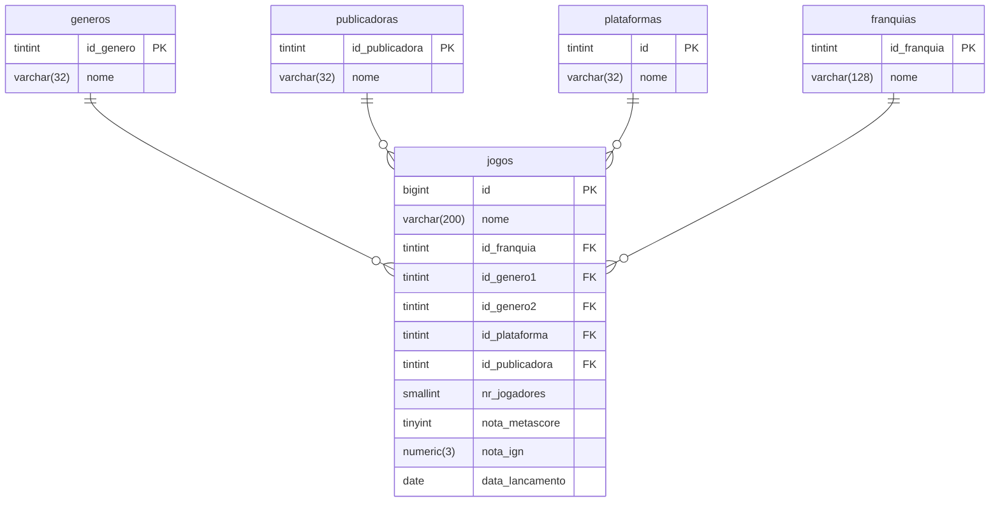
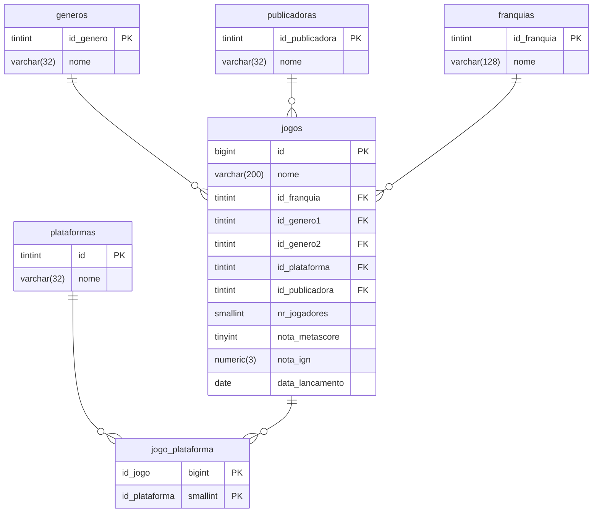
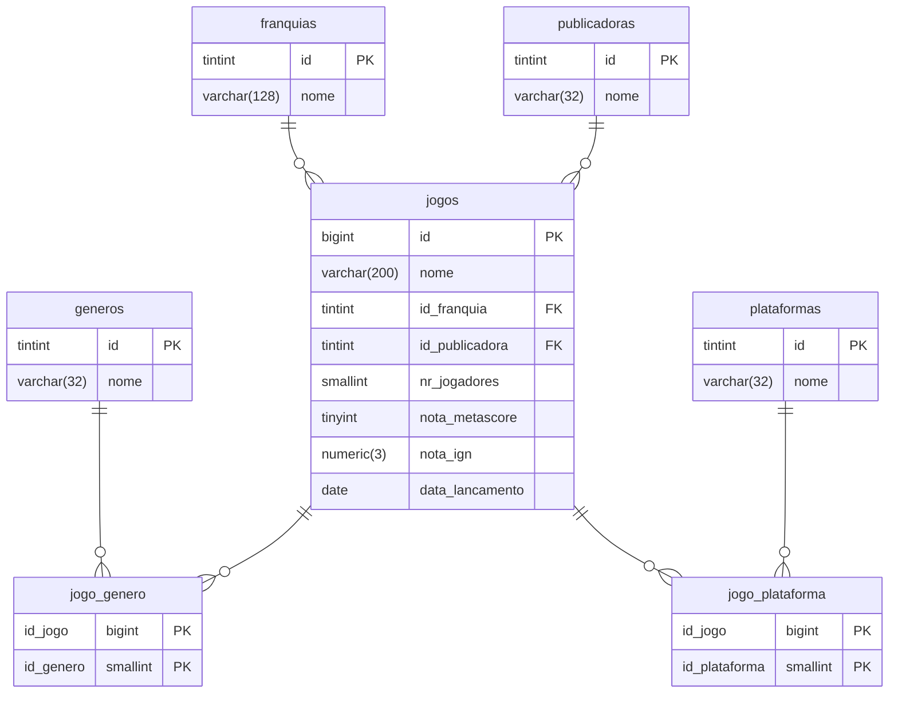

# Diagramas

Diagrama antes da tabela associativa :

```mermaid
erDiagram
    generos ||--o{ jogos : ""
    generos{
        tintint id_genero PK
        varchar(32) nome
    }
    publicadoras ||--o{ jogos : ""
    publicadoras{
        tintint id_publicadora PK
        varchar(32) nome
    }
    plataformas ||--o{ jogos : ""
    plataformas {
        tintint id PK
        varchar(32) nome
    }
    franquias ||--o{ jogos : ""
    franquias {
        tintint id_franquia PK
        varchar(128) nome
    }
    jogos {
        bigint id PK
        varchar(200) nome
        tintint id_franquia FK
        tintint id_genero1 FK
        tintint id_genero2 FK
        tintint id_plataforma FK
        tintint id_publicadora FK
        smallint nr_jogadores
        tinyint nota_metascore
        numeric(3) nota_ign
        date data_lancamento
    }

```

Diagrama após a tabela associativa :

```mermaid
erDiagram
    generos ||--o{ jogos : ""
    generos{
        tintint id_genero PK
        varchar(32) nome
    }
    publicadoras ||--o{ jogos : ""
    publicadoras{
        tintint id_publicadora PK
        varchar(32) nome
    }
    plataformas ||--o{ jogo_plataforma : ""
    jogos ||--o{ jogo_plataforma : ""
    jogo_plataforma{
        id_jogo bigint PK
        id_plataforma smallint PK
    }
    plataformas {
        tintint id PK
        varchar(32) nome
    }
    franquias ||--o{ jogos : ""
    franquias {
        tintint id_franquia PK
        varchar(128) nome
    }
    jogos {
        bigint id PK
        varchar(200) nome
        tintint id_franquia FK
        tintint id_genero1 FK
        tintint id_genero2 FK
        tintint id_plataforma FK
        tintint id_publicadora FK
        smallint nr_jogadores
        tinyint nota_metascore
        numeric(3) nota_ign
        date data_lancamento
    }

```

Diagrama com duas tabelas associativas e como modelo final :

```mermaid
erDiagram
    generos{
        tintint id PK
        varchar(32) nome
    }
    publicadoras ||--o{ jogos : ""
    publicadoras{
        tintint id PK
        varchar(32) nome
    }
    plataformas {
        tintint id PK
        varchar(32) nome
    }
    franquias ||--o{ jogos : ""
    franquias {
        tintint id PK
        varchar(128) nome
    }
    plataformas ||--o{ jogo_plataforma : ""
    jogos ||--o{ jogo_plataforma : ""
    jogo_plataforma{
        id_jogo bigint PK
        id_plataforma smallint PK
    }

    generos ||--o{ jogo_genero : ""
    jogos ||--o{ jogo_genero : ""
    jogo_genero{
        id_jogo bigint PK
        id_genero smallint PK
    }
    jogos {
        bigint id PK
        varchar(200) nome
        tintint id_franquia FK
        tintint id_publicadora FK
        smallint nr_jogadores
        tinyint nota_metascore
        numeric(3) nota_ign
        date data_lancamento
    }

```
